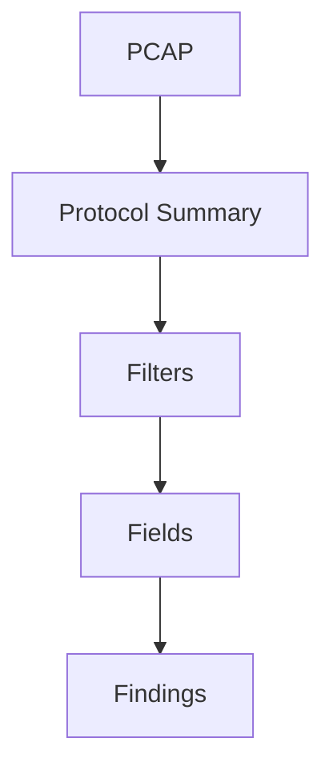

---
title:
type:
source:
dg-publish: true
---

# 

> [!info] Navigation
> [[Home]] | [[Master Table of Contents]] | [[Exam Cram Guide]] | [[Command Dashboard]] | [[Curated External Sources]] | [[Main/03 - Study Materials/eJPT/10 - Visual Diagrams/Index]]

## Sections in This Note

---

## Visual Diagram

## Related
- [[Exam Cram Guide]]
- [[Command Dashboard]]
