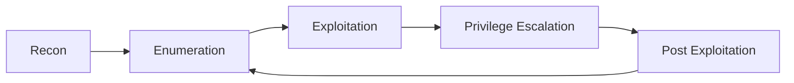

# 📖 Methodology
---

# 📖 Methodology

  

A reusable pentesting methodology hub. These notes should be platform-agnostic and useful across CTFs, labs, and real study.

  

## Core Flow

  

- [[Methodology/Assessment/index|Assessment]]

- [[Methodology/Reconnaissance/index|Reconnaissance]]

- [[Methodology/Enumeration/index|Enumeration]]

- [[Methodology/Exploitation/index|Exploitation]]

- [[Methodology/Privilege-Escalation/index|Privilege Escalation]]

- [[Methodology/Post-Exploitation/index|Post Exploitation]]

- [[Methodology/Networking/index|Networking]]

  

## Quick Methodology Loop

